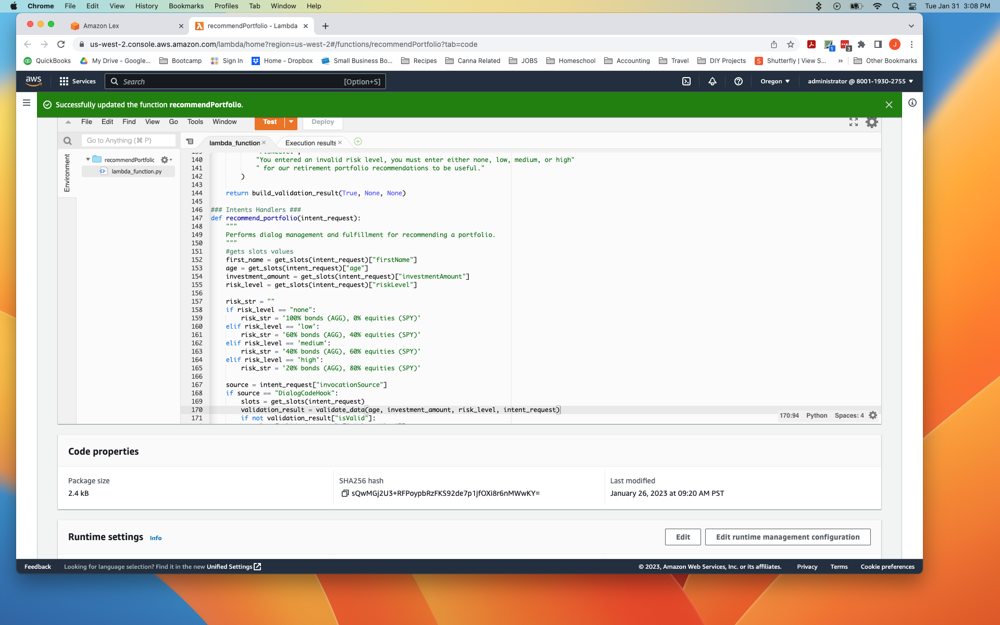

# AWS_bot
This project highlights the use of Amazon's digital services in a retirement portfolio robo advisor.  Through the use of an Amazon Lex bot for live interaction with a user, and Amazon's Lambda service, a bot is programed to recognize a user's request for information and evaluate the best response.

## Technologies
Python 3.7

Online access to Amazon Web Services

## Required Libraries ##
import json

from datetime import datetime

from dateutil.relativedelta import relativedelta

---

## Configuring the Bot ##
1. The Lex Service was used to configure a natural language model (NLP) bot which takes in sample utterances the user enters to get recommendations on retirement investing.

2. The bot interacts wtih the user to collect information from the user which is needed to make retirement portfolio recommendations

## Connecting to Lambda ##

**Lambda/lambda.py**
1. Python code was written to take in the user information gathered by the bot and add additional data validation filters. Invalid responses trigger the bot to reprompt the user for a valid response.

2. The Python code filters the valid user responses further, to provide an appropriate retirement portfolio investment response recommendation via the bot.

**Test_Events/*.png**

3. The python code is tested with json formatted code mimicing various typs of possible user responses, to verify the sucessful run of the lambda function.

---

## Rob Advisor ##
The use of the AWS systems should produce a robo-advisor chat bot to take in user input and respond with an appropriate retirement investment recommendation.  Future development of this bot could include more nuanced advice, more sample utterances, and the depoloyment to an app or webpage.

